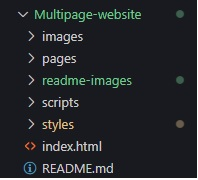

<h1 align="center">Multipage website</h1>

The purpose of the project was to use HTML, SASS, JavaScript and jQuery to create a multipage website that allowed users to view, like, comment and save images and blog posts.

## Table of Contents

* [About the Project](#about-the-project)
* [Installation](#installation)
* [Usage](#usage)
* [Acknowledgments](#acknowledgments)

## About the Project

 

   

 

There are key elements required for this task to showcase the skills learnt in the course to date.  

* HTML
    - Forms
        - Contact form
        - Comment form (if the user would like to post a comment)
    - Like and bookmark/save options for every image and blog post
    - A *Save for Later* page. Any saved/bookmarked images or/and blog posts are stored in the user's folder in the localStorage and can be viewed on the *Save for Later* page.
    - Table
    - Drop-down menu
* SASS
    - I personally followed the BEM methodology and 7-1 Pattern SASS architecture for maintainable CSS and SASS.
* JavaScript and jQuery
    - Local and session storage 
    - Toggle like buttons
    - The option of bookmarking/saving images and blog posts for later viewing
    - Handling forms (comment form)
    - Creating objects
    - Animation
    - Drop-down menu
* Organized folder and file structure and ensuring code modularity and readability.
* The use of comments.

## Installation

* Select the green **Code** button  

  

* Select HTTPS and copy the URL 

   

* Open Git Bash.
* Change to the directory/folder where you want to clone the repository.
* To clone the repository, type `git clone` followed by the URL. 

  `$ git clone git@github.com:AlexaIsaks/Multipage-website.git`

* Press **Enter**. The repository will be cloned in your folder.

   

## Usage

* Open the Multipage-website folder in your favourite code editor and click on the `index.html` file.

   

* View the index.html using a live server. There are various extensions found on the Visual Studio Code Marketplace. 

  

* The index page should look like this:

* Other pages:

## Acknowledgments

**HyperionDev**

Certified Full Stack Web and Software Engineer 

**Website Design Inspiration:**

Website | URL
----|----
Ekrem Özlü Photography|https://www.ekremozluphotography.com/home1
ABHISHEK BALI|https://www.baliabhishek.com/home 
 

**Images:**

Image(s) | Photographer | URL
----|----|----
Portfolio page images | Annie Spratt | https://unsplash.com/@anniespratt
simon-greenwood-south-africa.jpg | Simon Greenwood | https://unsplash.com/photos/VQu-sTjo4bs
ishan-seefromthesky-maldives.jpg | Ishan | https://unsplash.com/photos/Fj_39H4NeOo
anthony-delanoix-paris.jpg |  Anthony Delanoix |  https://unsplash.com/photos/QAwciFlS1g4

